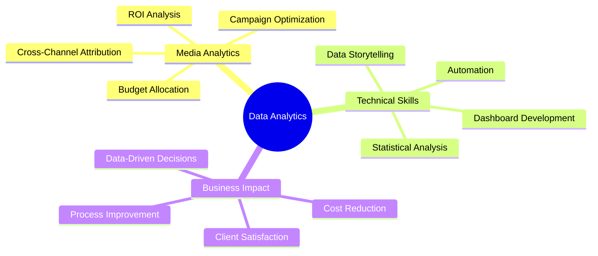

# Hi there, I'm Nihaal! 👋

<div align="center">
  
[](https://git.io/typing-svg)

</div>

## 🚀 About Me

```python
class DataAnalyst:
    def __init__(self):
        self.name = "Nihaal"
        self.role = "Senior Analyst @ UM Worldwide"
        self.location = "New York City 🗽"
        self.experience = "3+ years"
        self.current_focus = "Data analytics & data science"
        self.passion = "Contributing to high-impact initiatives that drive meaningful change"
        
    def seeking(self):
        return "Data Analytics/Data Science opportunities"
        
```

## 🛠️ Tech Stack & Tools

*Building expertise across the data analytics ecosystem*

### Languages & Analytics


### Visualization & BI Tools


## 🎯 Featured Projects

### 🔮 [Employee Retention Prediction](https://github.com/NihaalShameem/employee-retention-prediction)
> **Logistic regression model achieving 86% precision** predicting attrition drivers
- **Impact**: Potential 15%+ turnover reduction through proactive HR intervention
- **Tech**: Python, Scikit-learn, Statistical Analysis
- **Focus**: Low satisfaction score identification and risk assessment

### 🎵 [TikTok Content Classifier](https://github.com/NihaalShameem/tiktok-content-classifier)
> **Random Forest model with 99.5% recall** for content classification
- **Impact**: 25% user retention boost potential, 30% moderation efficiency
- **Tech**: Python, Random Forest, Content Analysis
- **Innovation**: Claims vs. opinions classification for engagement optimization

### 🐕 [NYC Dog Bites Safety Analysis](https://github.com/NihaalShameem/nyc-dog-bites-analysis)
> **Interactive dashboard analyzing 20K+ incident records**
- **Impact**: 5-10% incident reduction potential, 40% faster analysis
- **Tech**: Python, Tableau, Excel
- **Value**: High-risk zone identification for optimized resource allocation

## 🌟 Areas of Expertise



## 🏆 Key Achievements

🎯 **$10M+ Media Spend Optimization** - Reduced wasted spend by 15% across 10+ brands  
📈 **8% Client ROI Improvement** - Through automated Tableau dashboards and real-time optimization  
💰 **$500K+ Annual Cost Savings** - Identified through SKU management and inventory optimization  
⚡ **20% Reporting Efficiency Gain** - Automated cross-channel dashboards cutting manual work  
🎖️ **86% Model Precision** - Built predictive models for employee retention and content classification  

## 🚀 Current Goals

🎯 **Expanding into data science** - Building ML and advanced analytics capabilities  
📊 **Driving meaningful change** - Working on high-impact initiatives that matter  
🌱 **Continuous learning** - Staying current with latest analytics trends and tools  
🤝 **Collaboration** - Connecting with fellow data professionals and teams  

## 📫 Let's Connect!

<div align="center">

[](https://www.linkedin.com/in/nihaalshameem/)
[](https://github.com/NihaalShameem)
[](mailto:nihaalshameem@gmail.com)

</div>

---

<div align="center">
  
**"3+ years of turning data into insights in the heart of NYC"** 📊🗽


</div>
  

