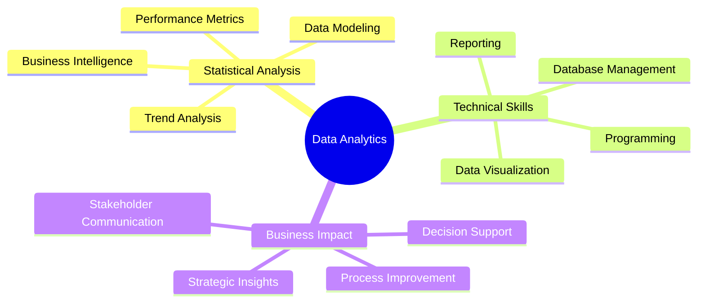

# Hi there, I'm Nihaal! 👋

<div align="center">
  
[](https://git.io/typing-svg)

</div>

## 🚀 About Me

```python
class DataAnalyst:
    def __init__(self):
        self.name = "Nihaal"
        self.role = "Senior Analyst @ UM Worldwide"
        self.location = "New York City 🗽"
        self.experience = "3+ years"
        self.current_focus = "Data analytics & data science"
        self.passion = "Contributing to high-impact initiatives that drive meaningful change"
        
    def seeking(self):
        return "Data analytics/data science opportunities"
        
    def mission(self):
        return "Driving meaningful change through data-driven insights"
```

## 🛠️ Tech Stack & Tools

*Building expertise across the data analytics ecosystem*

### Languages & Analytics


### Data Science & Analytics


### Visualization & BI Tools


### Databases & Cloud


## 📊 GitHub Analytics

<div align="center">
  


</div>

<div align="center">
  
[](https://git.io/streak-stats)

</div>

## 🎯 Professional Experience

### 📈 Senior Analyst @ UM Worldwide
*Leveraging 3+ years of data analytics experience to drive business insights*

- **Focus Areas**: Data analytics, business intelligence, and strategic analysis
- **Impact**: Contributing to high-impact initiatives that create meaningful change
- **Location**: New York City
- **Passion**: Transforming complex data into actionable business strategies

## 🌟 Areas of Expertise



## 🚀 Current Goals

🎯 **Expanding into data science** - Building ML and advanced analytics capabilities  
📊 **Driving meaningful change** - Working on high-impact initiatives that matter  
🌱 **Continuous learning** - Staying current with latest analytics trends and tools  
🤝 **Collaboration** - Connecting with fellow data professionals and teams  

## 🌟 Professional Philosophy

> *"Passionate about contributing to high-impact initiatives that drive meaningful change through the power of data analytics."*

## 📫 Let's Connect!

<div align="center">

[](https://www.linkedin.com/in/nihaalshameem/)
[](https://github.com/NihaalShameem)
[](mailto:nihaalshameem@gmail.com)

</div>

---

<div align="center">
  
**"3+ years of turning data into insights in the heart of NYC"** 📊🗽


</div>


